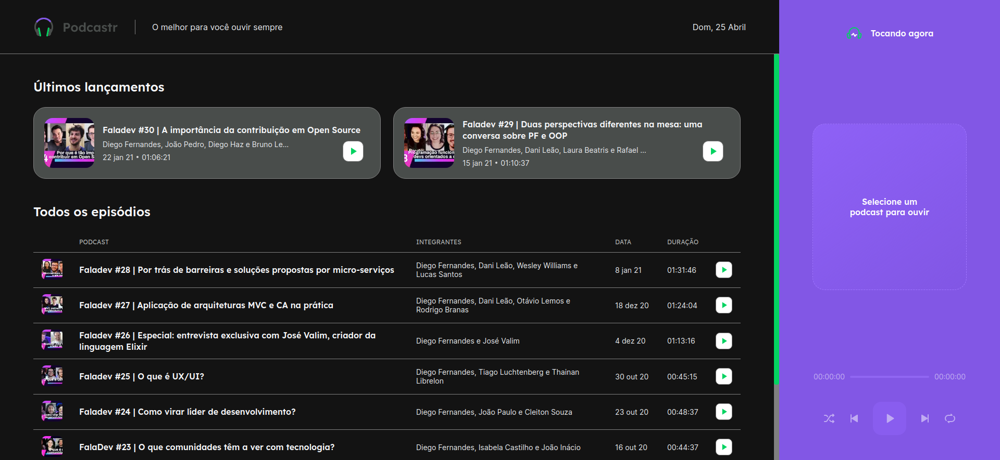
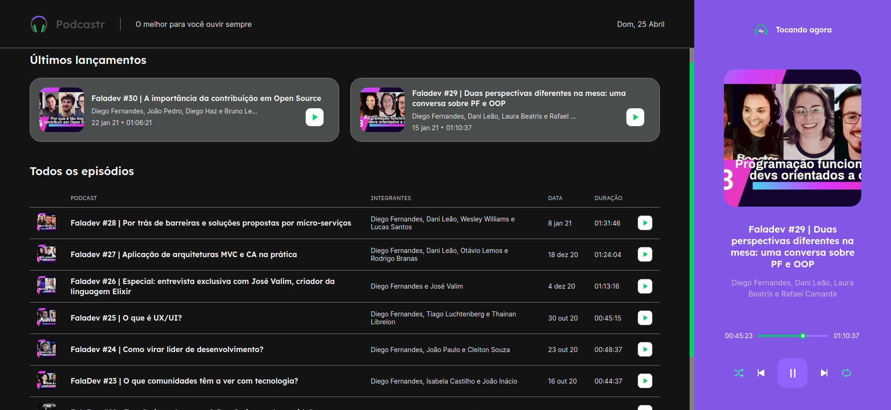
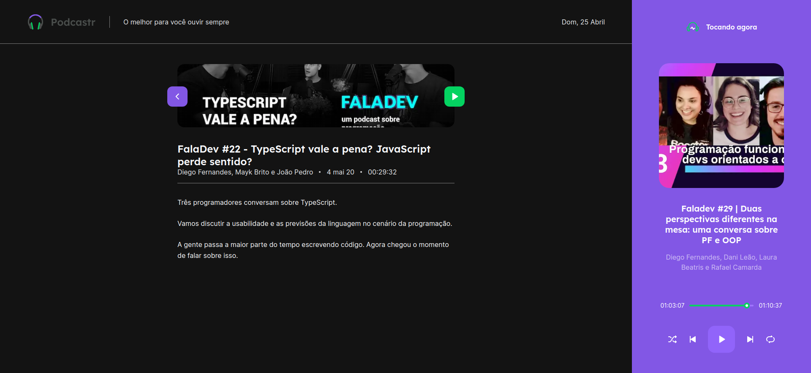

    <h1> Podcastr - NLW#5 - Trilha ReactJS</h1>
    

# Projeto
Projeto feito para acompanhar as aulas da edição 5 da NLW, da [Rocketseat](https://rocketseat.com.br/).

O Podcastr se trata de uma aplicação onde é possível ouvir os episódios do podcast FalaDev, da Rocketseat. Através do player é possível navegar entre os episódios, assim como é possível ativar o modo de repetição e o modo de lista aleatória.

Uma das coisas que mais gostei de praticar nesta NLW foi a geração de páginas estáticas com o Next.js, o que foi algo totalmente novo para mim.
## Tecnoligas e linguagens usadas

- React
- Typescript
- Next.js
- Scss
- JSON Server
- Libs:
  - rc-slider
  - date-fns

## Preview

    
    
(Página inicial, sem podcast selecionado)

    
    
(Página inicial, com podcast tocando e opções shuffle e repeat ativadas)

    
    
(Página com detalhe do episódio)

## Como executar o projeto localmente

- Clonar o repositório e acessar a pasta raiz do projeto
- Abrir o terminal na pasta raiz e:
  - Instalar as dependências com o comando `yarn install`
  - Executar o comando `yarn server` para rodar a fake api com JSON Server (Necessário fazer este passo em uma aba separada do terminal)
  - Executar o comando `yarn dev` para rodar o projeto em ambiente de desenvolvimento
  - Acessar o Podcastr em [`http://localhost:3000`](http://localhost:3000)
